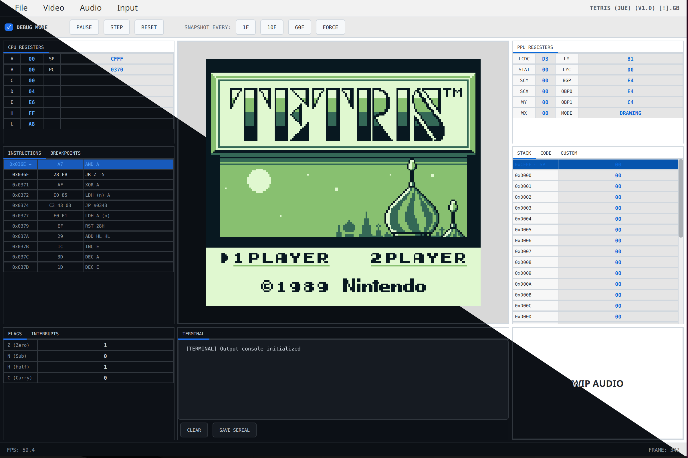
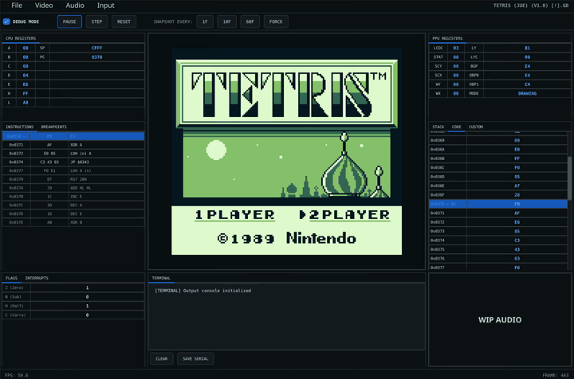
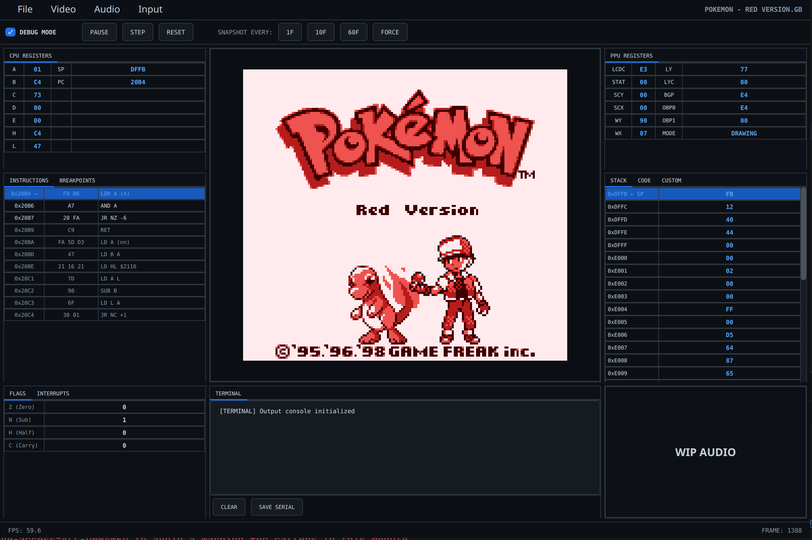
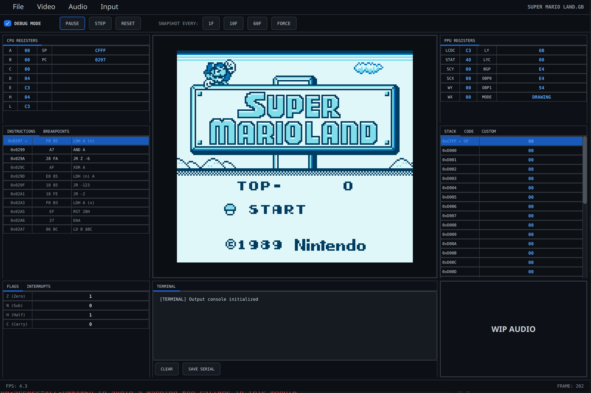
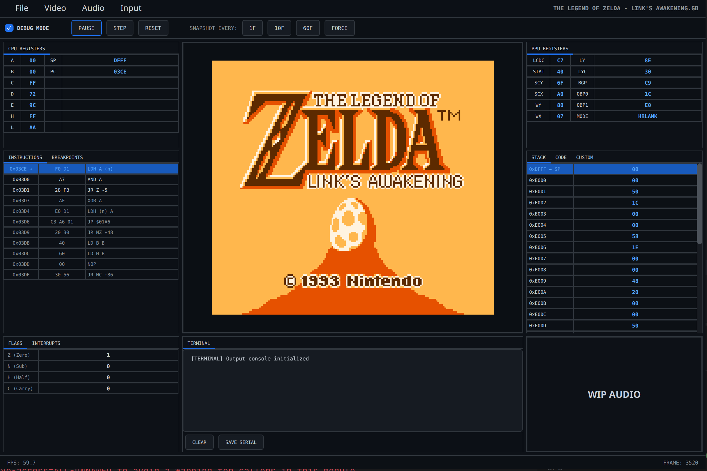
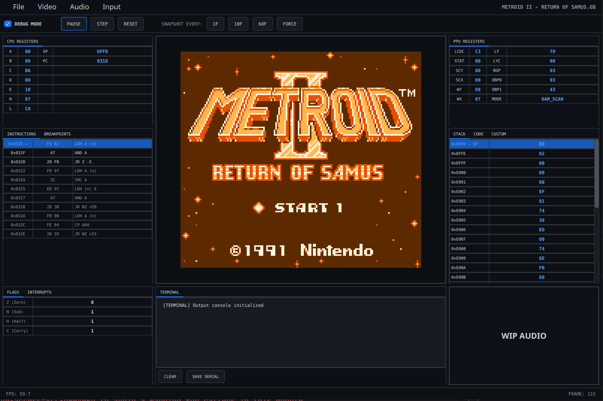
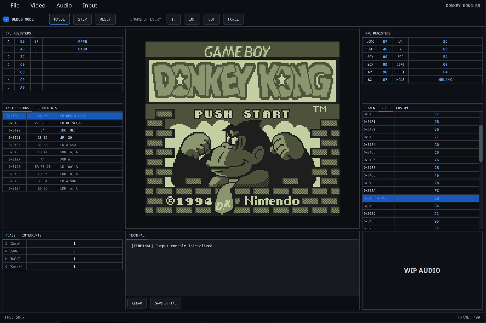
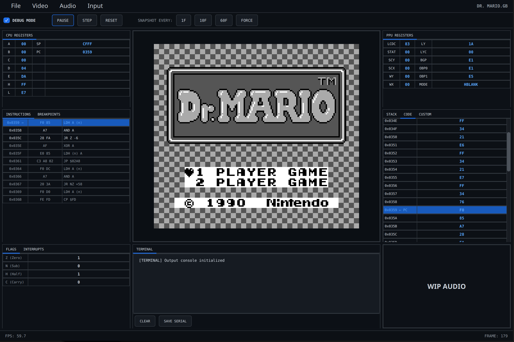
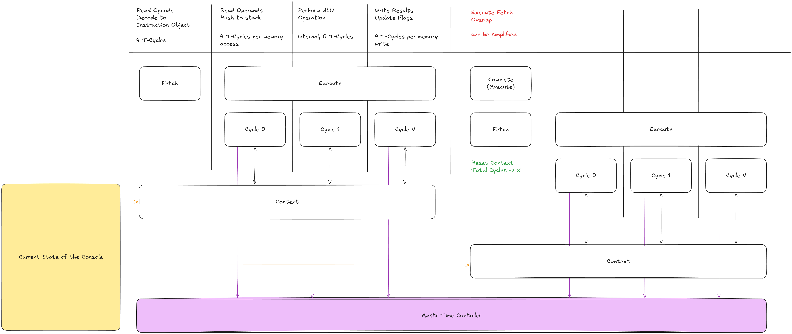

# jGB - Game Boy Emulator
A hardware emulator for the Game Boy (DMG) written in Java, created to explore low-level hardware emulation in a managed, object-oriented language. Features integrated debugging tools, a complete application environment and runs commercial Game Boy titles.

<p align="center">
  
</p>

## Features

- **Complete CPU Implementation** - All 512 LR35902 instructions implemented with sub-instruction cycle timing model
- **Working Game Compatibility** - Runs commercial titles such as Pokémon, Tetris, Super Mario, The Legend of Zelda
- **Memory Banking Controllers** - Full support for MBC0, MBC1, MBC2, and MBC3 with Real-Time Clock functionality
- **Comprehensive Debugging Tools** - Built-in CPU debugger, memory viewer, disassembler, and breakpoints with a snapshot system
- **Strong Test Coverage** - Passes 60+ industry-standard validation ROMs (63% pass rate) including all Blargg CPU instruction tests

## Showcase

<p align="center">
  
</p>

## Installation

### Download Release

Download the latest release from the [Releases](../../releases) page.

### Build from Source

**Requirements:**
- Java 17 or higher
- Maven 3.6+

**Steps:**

```bash
git clone https://github.com/dominikkolak/jGB.git
cd jGB

mvn clean package

java -jar target/jGB-1.0.jar
```

## Screenshots

| Pokémon Red | Super Mario Land | The Legend of Zelda |
|:-----------:|:----------------:|:-------------------:|
|  |  |  |

| Metroid II | Donkey Kong | Dr. Mario |
|:----------:|:-----------:|:---------:|
|  |  |  |


## Usage
The emulator provides a graphical interface by default and can also be run in headless mode for debugging purposes. A simplified backup interface is available as an alternative.

```bash
java -jar jGB.jar

java -jar jGB.jar --headless

java -jar jGB.jar --backup
```

The User Interface also provides options to reconfigure the control mapping and change color palettes, even to non-standard colors.

## Test Results

The emulator has been validated against standard Game Boy test suites with a 63% overall pass rate (60/95 tests):

### Strong Areas

- **CPU Instruction**: 100% pass rate on all individual Blargg CPU instruction tests (11/11)
- **Memory Banking**: Comprehensive MBC1 support (11/11 tests passed)
- **Timing**: Core timing behavior validated (mem_timing, instr_timing tests passed)
- **Hardware Registers**: Correct flag and register behavior

| Test Suite | Result |
|------------|--------|
| **Blargg CPU tests** | All individual instruction tests pass; full integration suite and interrupt timing need work |
| **Memory / timing tests** | Instruction and memory timing tests pass |
| **Mooneye acceptance tests** | 45+ tests passing; PPU timing and DMA edge cases remain |
| **MBC tests** | MBC1 fully functional; MBC2/MBC3 mostly working with minor RAM edge cases |

### Areas for Improvement
Some hardware edge cases remain to be implemented:

- **PPU Timing** - Accurate enough for commercial games, some test ROM edge cases fail
- **OAM DMA** - Functional for gameplay, some test-specific behaviors incomplete
- **Interrupt timing** - Core functionality works, complex edge cases need refinement

### Raw Results

Detailed per-test results are available here:

See: [test_results.pdf](docs/test_results.pdf)

## Debugging

The emulator includes the following debugging tools:

- **CPU Debugger** - Step-through execution with full register inspection
- **Memory Viewer** - Real-time memory inspection (PC, SP, custom regions)
- **Disassembler** - Live code disassembly at current program counter
- **Breakpoint System** - Address-based execution breakpoints
- **PPU Inspector** - Graphics subsystem state visualization
- **Interrupt Monitor** - Flag and interrupt state tracking

## Architecture
The emulator is organized and designed to mirror actual Game Boy hardware with clear separation of concerns:

<p align="center">
  
</p>

## Sub-Instruction Execution Model
Instructions are decomposed into machine cycles (M-cycles) rather than executed atomically. Each M-cycle represents hardware-level operations and consumes 4 T-cycles, with all components advancing in synchronized steps.

### Execution Flow
After each sub-operation, the CPU returns T-cycles consumed, and the Master Time Controller advances all other components by the same amount.



This ensures all components observe the same passage of time and remain synchronized. This model provides better timing granularity than naive atomic executions, though perfect cycle accuracy would require additional refinement.

## Related Work
This repository has been consolidated from three previous repos. They can be found here in their own branches.

- https://github.com/dominikkolak/dmg-core-prototype
- https://github.com/dominikkolak/dmg-cpu-sm83-e
- https://github.com/dominikkolak/dmg-cpu-cart-e

## Disclaimer
The primary UI was built with the help of LLMs. Should its reliability be an issue, the emulator can be run with the `--backup` parameter to get a more robust but limited self-made UI.
